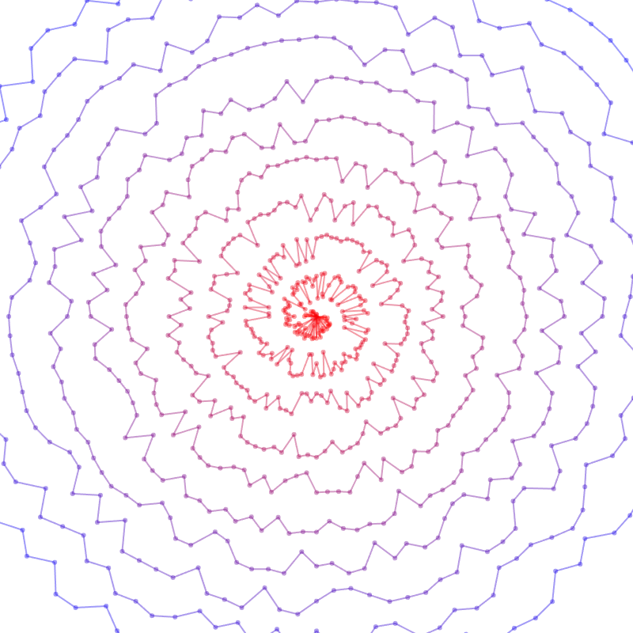

# Dynamic Spiral Pattern Using "Bee Movie" Script
[View the Sketch](https://editor.p5js.org/c_reed/sketches/jQcEiJ5B3)

This project generates a dynamic spiral pattern driven by pseudo-random values derived from the "Bee Movie" script. By iterating through a sequence of values, each derived from the ASCII values of the script's characters, the code creates a visually unique and evolving spiral.

## How It Works

1. **Value Generation**: 
   - The "Bee Movie" script is read character by character.
   - For each character, its ASCII value (the numeric representation of the character) is retrieved using the `ord()` function.
   - This ASCII value is used to increment the sequence's index, making the next character’s index shift by the value of the current character's ASCII code. This process continues until the entire script is parsed.

2. **Spiral Creation**:
   - The sequence of generated values is used to control the radius of the spiral at each iteration.
   - As the spiral grows, the radius values cause it to expand in a tight, dynamic manner. The changing values produce a visually intriguing and ever-evolving pattern.
   - In addition to the spiral's shape, the colors and transparency of the lines also change as the spiral grows, adding fluid, artistic effects to the pattern.

## Value Generation Insights

The pseudo-random values are derived from the "Bee Movie" script, using the characters' ASCII values to iteratively modify the sequence's index. Since the English language has a wide variety of characters but not too many repeating patterns, I thought it would be interesting to use this large data set for generating random values. With the approach I used, the distribution of values should remain fairly balanced. Since the ASCII values of the characters aren't overly biased in a way that would skew the random distribution, the results are fairly even across the sequence. Plus, as the script's length is large, it provides a nice, diverse range of values without having to worry too much about patterns influencing the outcome.

